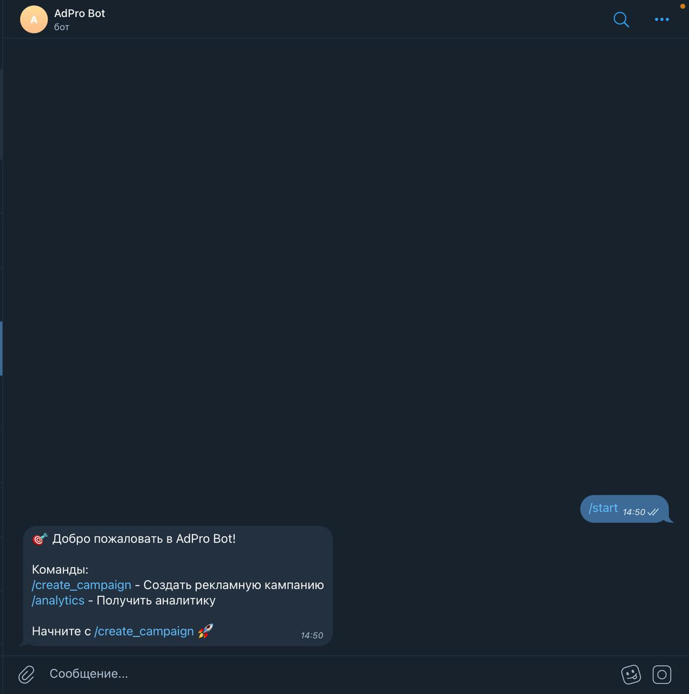
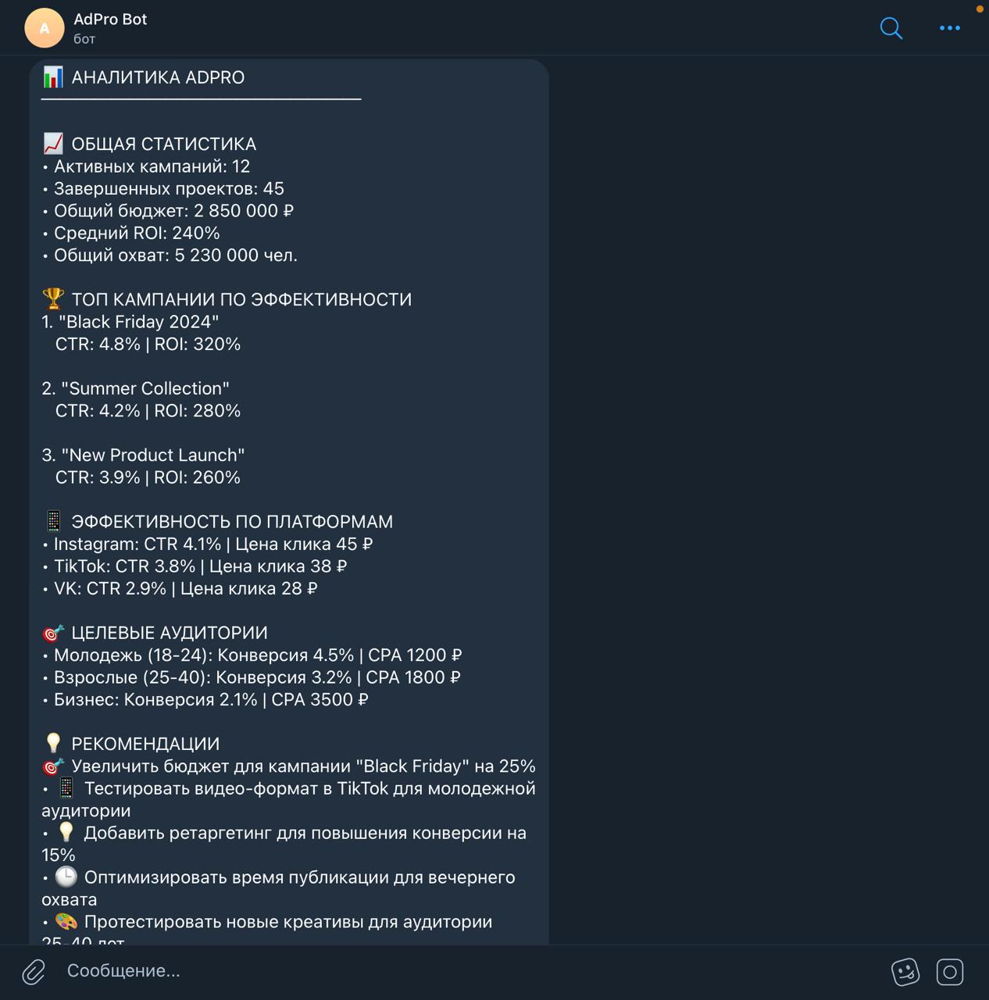
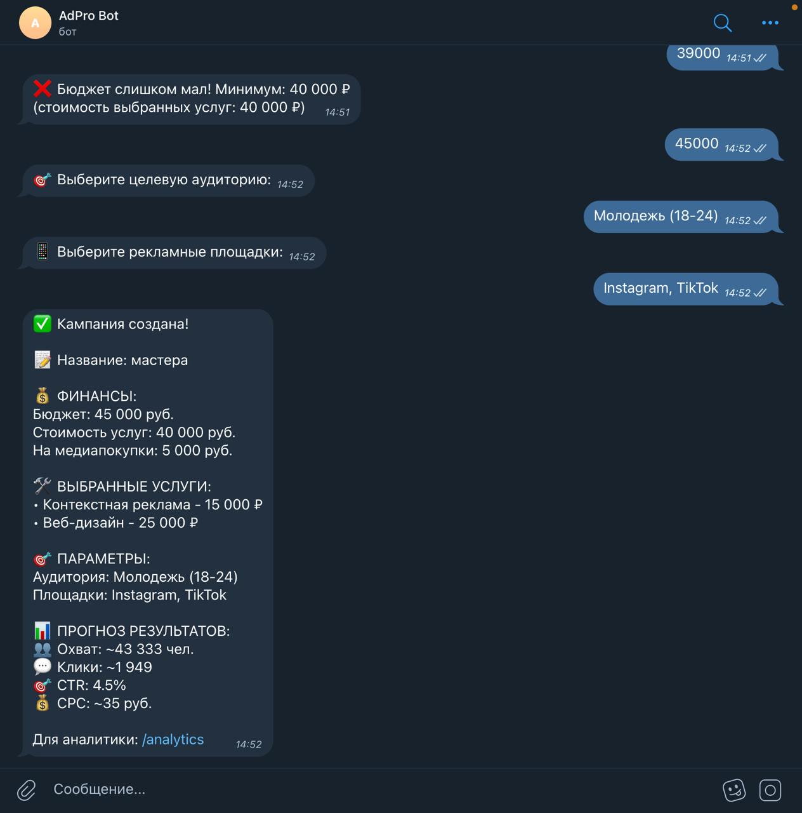
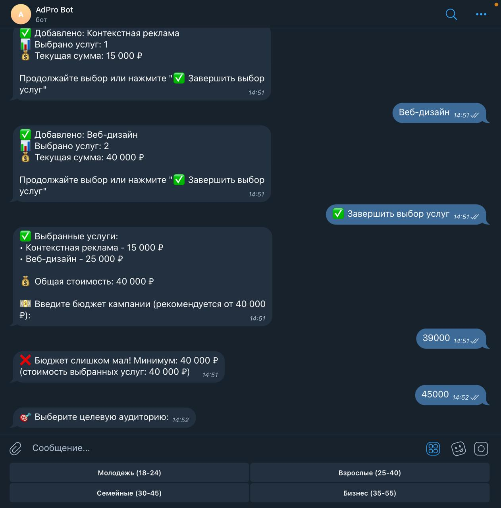
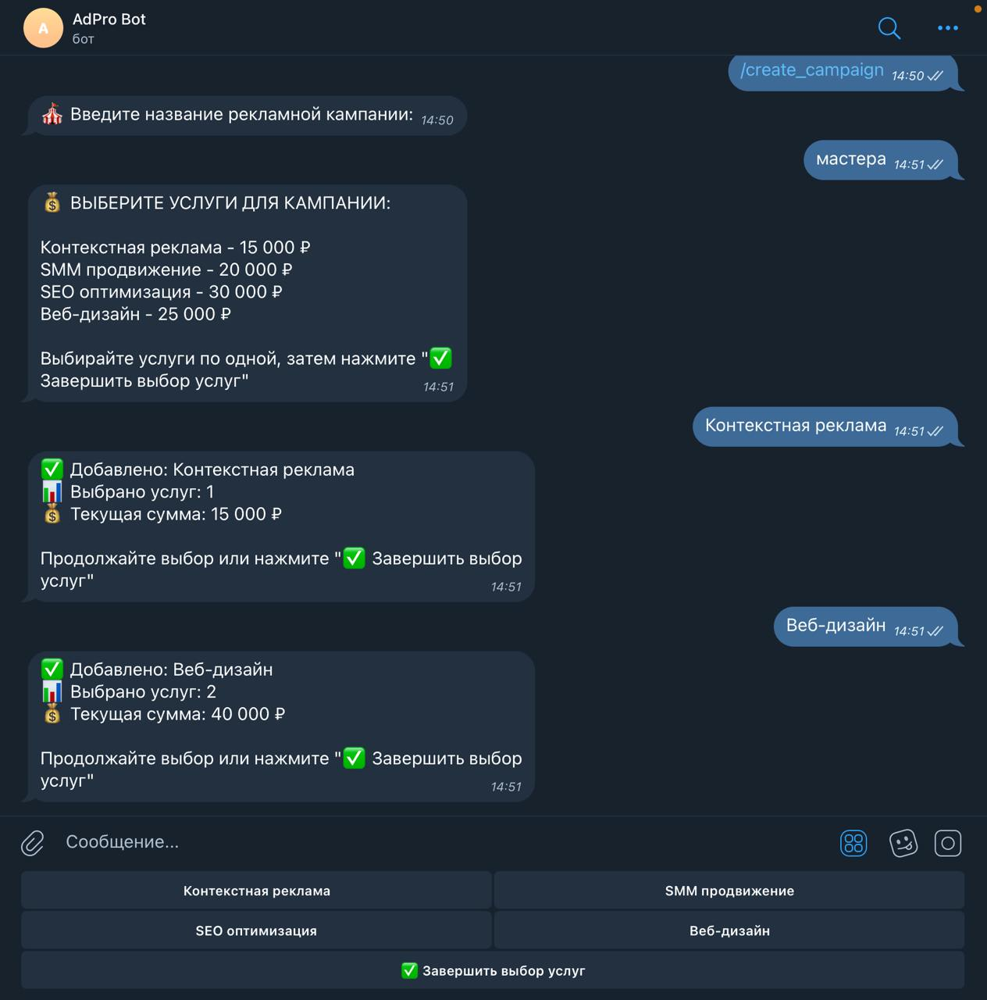
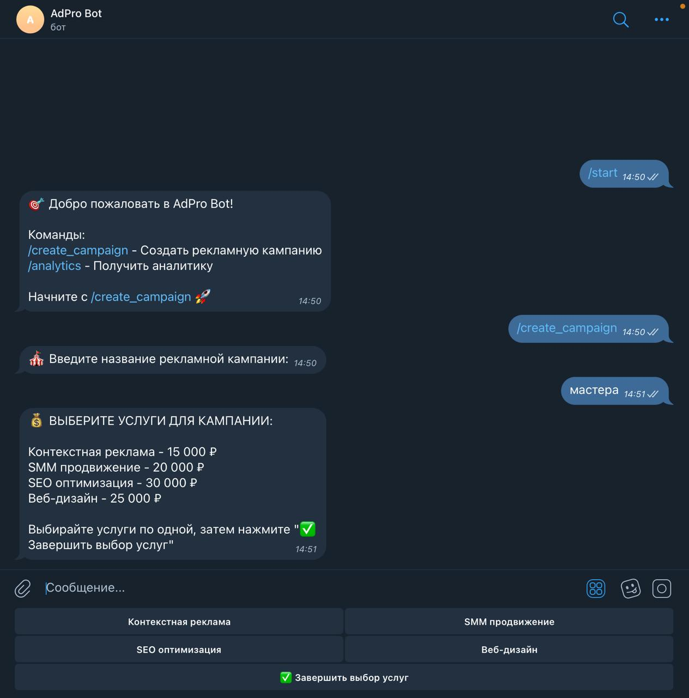

# AdPro Bot - Telegram Bot for Advertising Agency

## Описание
Telegram бот для создания рекламных кампаний и аналитики

## Установка и запуск
1. npm install
2. Создать .env с TELEGRAM_BOT_TOKEN
3. npm start

## Команды
- /start - приветствие
- /create_campaign - создать кампанию
- /analytics - получить аналитику

## Скриншоты
[Добавить скриншоты работы бота]

 
 
 
 

## Команды разработки
- npm test - запуск тестов
- npm run lint - проверка кода
- npm run test:coverage - покрытие кода