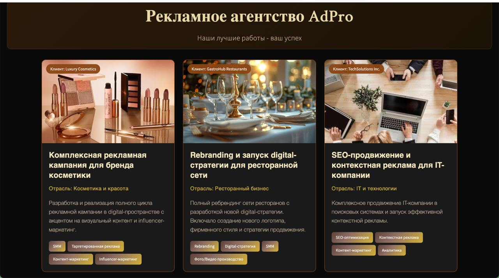
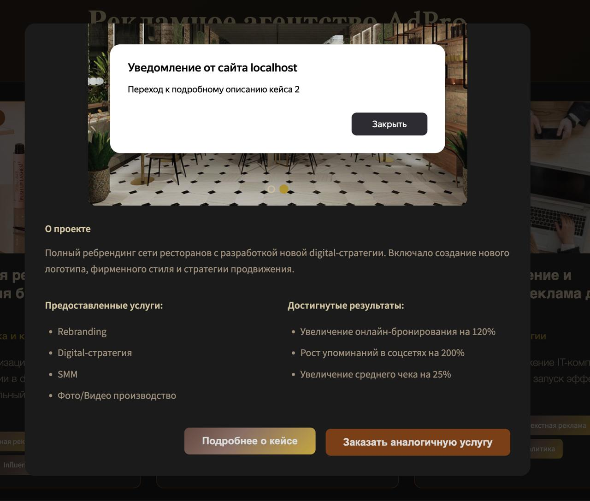
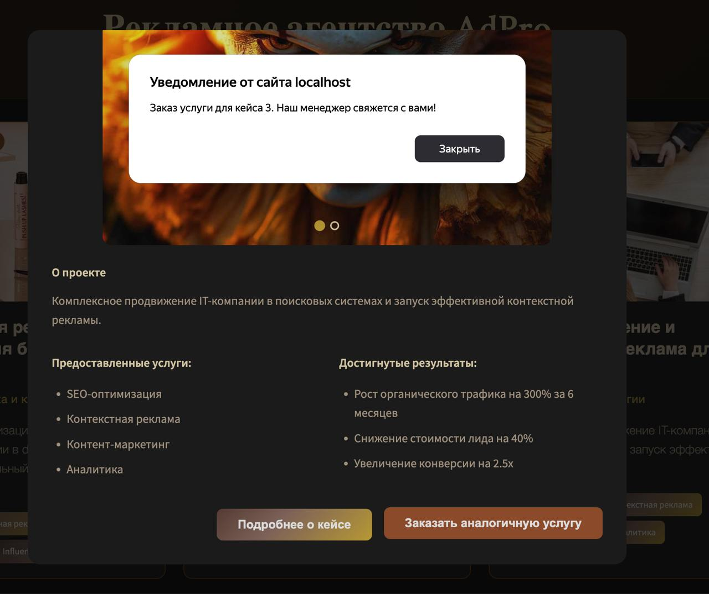

## Описание проекта

Этот проект представляет собой библиотеку React компонентов для рекламного агентства и демонстрационное приложение, показывающее их использование. Проект разделен на две основные части:

ui-library/ - библиотека переиспользуемых React компонентов для рекламного агентства
website/ - демонстрационное приложение с примерами использования компонентов

## Технологии

- React 18.3.1 с TypeScript
- Vite для сборки
- Jest + Testing Library для тестирования
- ESLint для линтинга
- CSS Modules для стилизации

## Компоненты библиотеки

### PortfolioCase

Карточка кейса с результатами работ (портфолио):
- Название работы и описание
- Клиент, отрасль и ключевые характеристики
- Изображение и галерея работ
- Интерактивный слайдер изображений
- Модальное окно с полной информацией
- Кнопки для просмотра деталей и заказа услуги

## Инструкция по запуску

### Предварительные требования

- Node.js 18+
- npm

### Установка и запуск

1. Клонирование репозитория

git clone <repository-url>
cd student-5

2. Установка зависимостей и запуск UI Library

cd ui-library
npm install
npm run build

3. Запуск демо-приложения

cd ../website
npm install
npm run dev

4. Открытие в браузере
Приложение будет доступно по адресу: http://localhost:3000

## Скрипты проекта

### UI Library (ui-library/)

npm run build - сборка библиотеки
npm run dev - разработка с вотчером
npm run test - запуск тестов
npm run lint - проверка кодстайла
npm run test:coverage - запуск тестов с генерацией отчета о покрытии кода

### Website (website/)

npm run dev - запуск dev-сервера на порту 3000
npm run build - сборка для production
npm run test - запуск тестов
npm run lint - проверка кодстайла

## Примеры работы приложения:

